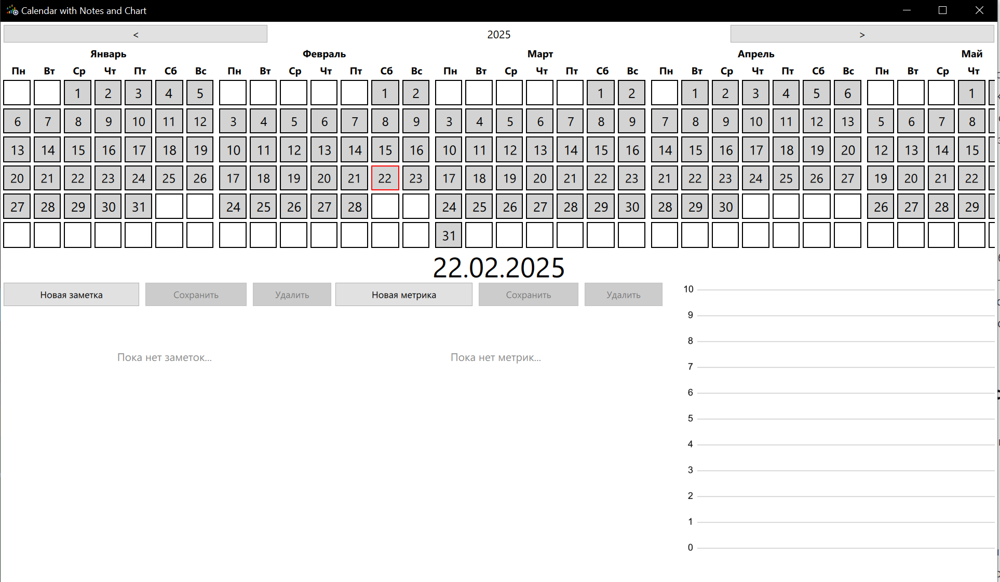
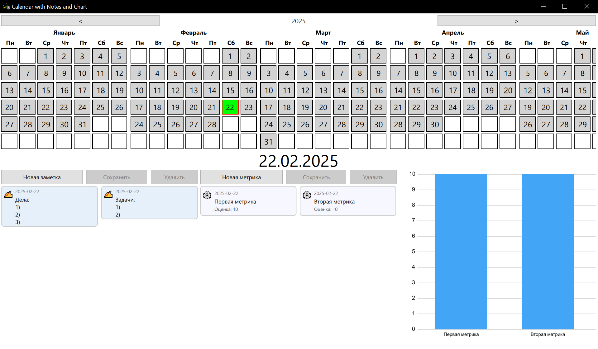
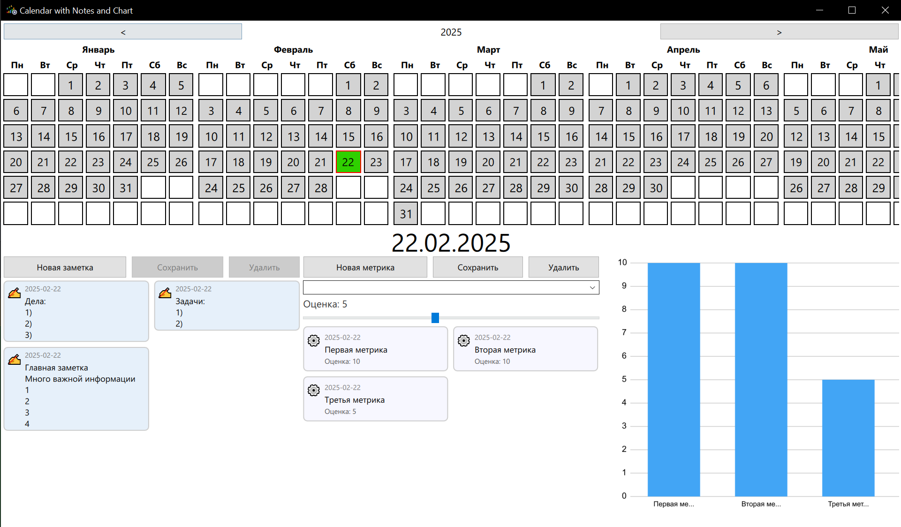

# 📅 Day Note Metric Calendar

Интерактивное приложение на **Qt/QML** для ведения дневной статистики: заметки, метрики, календарь и графики — всё в одном месте.  
Проект выполнен в рамках тестового задания.

---

## ✨ Возможности

- **Календарь**
  - Выбор любого дня года.
  - Подсветка цвета дня в зависимости от средней оценки метрик (от красного до зелёного).
  
- **Заметки**
  - Добавление, редактирование и удаление заметок для выбранной даты.
  
- **Метрики**
  - Добавление пользовательских видов метрик.
  - Оценка каждой метрики по шкале от 1 до 10.
  
- **График**
  - Отображение всех оценок метрик за выбранный день в удобном визуальном виде.

- **Сохранение данных**
  - Используется **SQLite** для хранения всех заметок и метрик.
  - Данные сохраняются между сессиями.

---

## 🎥 Демонстрация


---

## 🖼 Скриншоты
| Календарь | Заметки и метрики | График |
|-----------|------------------|--------|
|  |  |  |

---

## 🛠 Технологии

- **Qt 6** / **Qt Quick** / **QML**
- **QtQuick.Controls** и **Layouts** для адаптивного интерфейса
- **SQLite** для хранения данных
- **C++ backend** для работы с базой и логикой

---

## 📂 Структура проекта

```
src/
 ├── main.cpp            # Точка входа
 ├── view/
 │   ├── MainWindow.qml  # Главное окно приложения
 │   ├── calendar/       # Компоненты календаря
 │   ├── note/           # Компоненты заметок
 │   ├── metric/         # Компоненты метрик
 │   └── MyChart.qml     # График метрик
 ├── model/              # Логика данных (Model) (в планах)
 └── controller/         # Управление логикой и доступом к базе данных
icons/                   # Иконки приложения
```

---

## 🚀 Запуск

1. Установите **Qt 6** (или совместимую версию).
2. Клонируйте репозиторий:
   ```bash
   git clone https://github.com/amareigi/day-note-metric-calendar-qt-qml-cpp.git
   cd day-note-metric-calendar-qt-qml-cpp
   ```
3. Соберите проект:
   - Через **Qt Creator** (открыть CMake-проект).
   - Или в консоли:
     ```bash
     mkdir build && cd build
     cmake ..
     cmake --build .
     ```
4. Запустите приложение.

---

## 📌 Планы по улучшению

- Экспорт данных в CSV/JSON.
- Фильтрация и статистика за период.
- Темная и светлая темы.
- Локализация на разные языки.

---

## 📄 Лицензия
MIT License — свободное использование, изменение и распространение.
